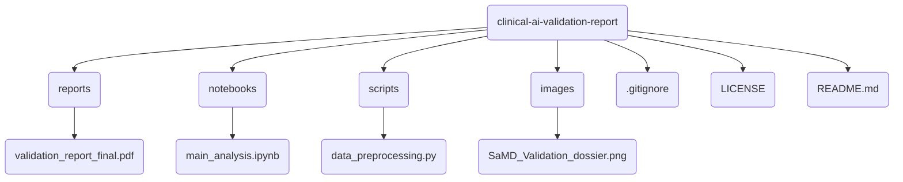

# Sero-Mix: A Transdimensional Bayesian Framework to Estimate Primary and Breakthrough Infection Burdens of Novel Immune-Evasive Viruses


### Overview
The SeroMix package provides a robust, validated statistical tool to classify individuals into "infected" and "uninfected" groups based on serological titre data. It uses a simple but powerful two-component Gaussian Mixture Model implemented in Stan to provide reliable probabilistic classifications.

This package is the result of a rigorous development process that demonstrated that more complex longitudinal models were not identifiable with the available data. The resulting baseline model is fast, stable, and provides a crucial performance benchmark for serological classification tasks.

### Installation
You can install the development version of SeroMix from GitHub with:

```R
install.packages("devtools")
devtools::install_github("drbalajiramanathan/SeroMix")
```

### Usage
The package contains one main function: run_seromix_baseline(). It takes a data frame containing individual IDs and their corresponding titre values.

Here is a minimal working example:

```R

library(SeroMix)

# 1. Create some sample data
# In a real scenario, you would load your own data here.
sample_data <- data.frame(
  id = rep(1:10, each = 5),
  titre_value = c(rnorm(25, mean = 0.5), rnorm(25, mean = 2.0))
)

# 2. Run the baseline model
# This will compile the model (on first run) and fit the data.
results <- run_seromix_baseline(sample_data)

# 3. View the results
# The output is a CmdStanMCMC object with the model results.
print(results)
```

### Interpreting the Results
The primary output of the model includes:

- mu[1]: The mean log-titre for the "uninfected" group.

- mu[2]: The mean log-titre for the "infected" group.

- theta[1] and theta[2]: The estimated proportions of the "uninfected" and "infected" groups in the population.
Excellent model convergence can be confirmed by rhat values of 1.00 and high ess_bulk values.
---

### Project Structure


---

### Contact
For questions or collaborations, please connect with me on LinkedIn:

<table border="0" align="center">
<tr>
  <td valign="middle">
    <a href="https://cytos.dev" target="_blank">
      
    </a>
    <br>
    <a href="https://www.linkedin.com/in/drbalajiramanathan/" target="_blank">
      
    </a>
  </td>
  <td valign="middle" align="left" style="padding-left:20px;">
    <h3 style="margin: 0;">© 2025 Dr.Balaji Ramanathan</h3>
  </td>
</tr>
</table>

---
